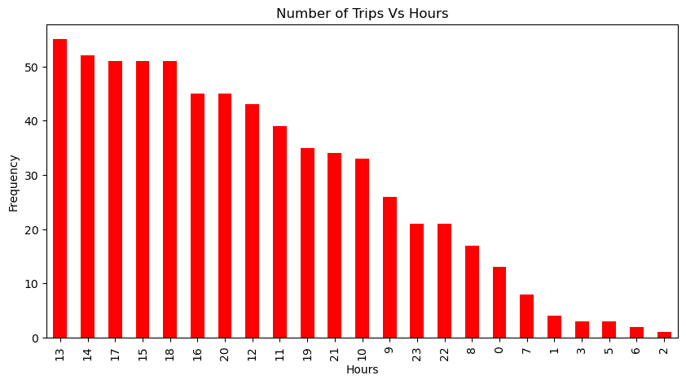

# Data-Analysis-on-UBER

```python
import pandas as pd
import numpy as np
import matplotlib.pyplot as plt
import seaborn as sns
import datetime
import calendar
```


```python
data = pd.read_csv('Uber Drives - .csv')
```


```python
data.head()
```


<div>
<style scoped>
    .dataframe tbody tr th:only-of-type {
        vertical-align: middle;
    }

    .dataframe tbody tr th {
        vertical-align: top;
    }

    .dataframe thead th {
        text-align: right;
    }
</style>
<table border="1" class="dataframe">
  <thead>
    <tr style="text-align: right;">
      <th></th>
      <th>START_DATE*</th>
      <th>END_DATE*</th>
      <th>CATEGORY*</th>
      <th>START*</th>
      <th>STOP*</th>
      <th>MILES*</th>
      <th>PURPOSE*</th>
    </tr>
  </thead>
  <tbody>
    <tr>
      <th>0</th>
      <td>1/1/2016 21:11</td>
      <td>1/1/2016 21:17</td>
      <td>Business</td>
      <td>Fort Pierce</td>
      <td>Fort Pierce</td>
      <td>5.1</td>
      <td>Meal/Entertain</td>
    </tr>
    <tr>
      <th>1</th>
      <td>1/2/2016 1:25</td>
      <td>1/2/2016 1:37</td>
      <td>Business</td>
      <td>Fort Pierce</td>
      <td>Fort Pierce</td>
      <td>5.0</td>
      <td>NaN</td>
    </tr>
    <tr>
      <th>2</th>
      <td>1/2/2016 20:25</td>
      <td>1/2/2016 20:38</td>
      <td>Business</td>
      <td>Fort Pierce</td>
      <td>Fort Pierce</td>
      <td>4.8</td>
      <td>Errand/Supplies</td>
    </tr>
    <tr>
      <th>3</th>
      <td>1/5/2016 17:31</td>
      <td>1/5/2016 17:45</td>
      <td>Business</td>
      <td>Fort Pierce</td>
      <td>Fort Pierce</td>
      <td>4.7</td>
      <td>Meeting</td>
    </tr>
    <tr>
      <th>4</th>
      <td>1/6/2016 14:42</td>
      <td>1/6/2016 15:49</td>
      <td>Business</td>
      <td>Fort Pierce</td>
      <td>West Palm Beach</td>
      <td>63.7</td>
      <td>Customer Visit</td>
    </tr>
  </tbody>
</table>
</div>


## Checking for missing data


```python
data.isnull()
```


<div>
<style scoped>
    .dataframe tbody tr th:only-of-type {
        vertical-align: middle;
    }

    .dataframe tbody tr th {
        vertical-align: top;
    }

    .dataframe thead th {
        text-align: right;
    }
</style>
<table border="1" class="dataframe">
  <thead>
    <tr style="text-align: right;">
      <th></th>
      <th>START_DATE*</th>
      <th>END_DATE*</th>
      <th>CATEGORY*</th>
      <th>START*</th>
      <th>STOP*</th>
      <th>MILES*</th>
      <th>PURPOSE*</th>
    </tr>
  </thead>
  <tbody>
    <tr>
      <th>0</th>
      <td>False</td>
      <td>False</td>
      <td>False</td>
      <td>False</td>
      <td>False</td>
      <td>False</td>
      <td>False</td>
    </tr>
    <tr>
      <th>1</th>
      <td>False</td>
      <td>False</td>
      <td>False</td>
      <td>False</td>
      <td>False</td>
      <td>False</td>
      <td>True</td>
    </tr>
    <tr>
      <th>2</th>
      <td>False</td>
      <td>False</td>
      <td>False</td>
      <td>False</td>
      <td>False</td>
      <td>False</td>
      <td>False</td>
    </tr>
    <tr>
      <th>3</th>
      <td>False</td>
      <td>False</td>
      <td>False</td>
      <td>False</td>
      <td>False</td>
      <td>False</td>
      <td>False</td>
    </tr>
    <tr>
      <th>4</th>
      <td>False</td>
      <td>False</td>
      <td>False</td>
      <td>False</td>
      <td>False</td>
      <td>False</td>
      <td>False</td>
    </tr>
    <tr>
      <th>...</th>
      <td>...</td>
      <td>...</td>
      <td>...</td>
      <td>...</td>
      <td>...</td>
      <td>...</td>
      <td>...</td>
    </tr>
    <tr>
      <th>1151</th>
      <td>False</td>
      <td>False</td>
      <td>False</td>
      <td>False</td>
      <td>False</td>
      <td>False</td>
      <td>False</td>
    </tr>
    <tr>
      <th>1152</th>
      <td>False</td>
      <td>False</td>
      <td>False</td>
      <td>False</td>
      <td>False</td>
      <td>False</td>
      <td>False</td>
    </tr>
    <tr>
      <th>1153</th>
      <td>False</td>
      <td>False</td>
      <td>False</td>
      <td>False</td>
      <td>False</td>
      <td>False</td>
      <td>False</td>
    </tr>
    <tr>
      <th>1154</th>
      <td>False</td>
      <td>False</td>
      <td>False</td>
      <td>False</td>
      <td>False</td>
      <td>False</td>
      <td>False</td>
    </tr>
    <tr>
      <th>1155</th>
      <td>False</td>
      <td>True</td>
      <td>True</td>
      <td>True</td>
      <td>True</td>
      <td>False</td>
      <td>True</td>
    </tr>
  </tbody>
</table>
<p>1156 rows × 7 columns</p>
</div>


```python
data.isnull().any()
```


    START_DATE*    False
    END_DATE*       True
    CATEGORY*       True
    START*          True
    STOP*           True
    MILES*         False
    PURPOSE*        True
    dtype: bool


```python
data.isnull().sum()
```


    START_DATE*      0
    END_DATE*        1
    CATEGORY*        1
    START*           1
    STOP*            1
    MILES*           0
    PURPOSE*       503
    dtype: int64


```python
data=data.dropna()
```


```python
data.isnull().sum()
```


    START_DATE*    0
    END_DATE*      0
    CATEGORY*      0
    START*         0
    STOP*          0
    MILES*         0
    PURPOSE*       0
    dtype: int64


```python
data.dtypes
```


    START_DATE*     object
    END_DATE*       object
    CATEGORY*       object
    START*          object
    STOP*           object
    MILES*         float64
    PURPOSE*        object
    dtype: object


### Converting datatypes of [ START_DAT , END_DATE ] from object to Date


```python
data['START_DATE*'] = pd.to_datetime(data['START_DATE*'], format='%m/%d/%Y %H:%M')
data['END_DATE*'] = pd.to_datetime(data['END_DATE*'], format='%m/%d/%Y %H:%M')
```

    C:\Users\prajw\AppData\Local\Temp\ipykernel_164\2068878997.py:1: SettingWithCopyWarning: 
    A value is trying to be set on a copy of a slice from a DataFrame.
    Try using .loc[row_indexer,col_indexer] = value instead
    
    See the caveats in the documentation: https://pandas.pydata.org/pandas-docs/stable/user_guide/indexing.html#returning-a-view-versus-a-copy
      data['START_DATE*'] = pd.to_datetime(data['START_DATE*'], format='%m/%d/%Y %H:%M')
    C:\Users\prajw\AppData\Local\Temp\ipykernel_164\2068878997.py:2: SettingWithCopyWarning: 
    A value is trying to be set on a copy of a slice from a DataFrame.
    Try using .loc[row_indexer,col_indexer] = value instead
    
    See the caveats in the documentation: https://pandas.pydata.org/pandas-docs/stable/user_guide/indexing.html#returning-a-view-versus-a-copy
      data['END_DATE*'] = pd.to_datetime(data['END_DATE*'], format='%m/%d/%Y %H:%M')
    


```python
data.dtypes
```


    START_DATE*    datetime64[ns]
    END_DATE*      datetime64[ns]
    CATEGORY*              object
    START*                 object
    STOP*                  object
    MILES*                float64
    PURPOSE*               object
    dtype: object


### adding the new columns for hour day month weekday and dayof month


```python
hour = []
day = []
dayofweek = []
month = []
weekday = []

for x in data['START_DATE*']:
    hour.append(x.hour)
    day.append(x.day)
    dayofweek.append(x.dayofweek)
    month.append(x.month)
    weekday.append(calendar.day_name[dayofweek[-1]])
data['HOUR'] = hour
data['DAY'] = day
data['DAY OF WEEK'] = dayofweek
data['MONTH'] = month
data['WEEKDAY'] = weekday
```

    C:\Users\prajw\AppData\Local\Temp\ipykernel_164\2147861469.py:13: SettingWithCopyWarning: 
    A value is trying to be set on a copy of a slice from a DataFrame.
    Try using .loc[row_indexer,col_indexer] = value instead
    
    See the caveats in the documentation: https://pandas.pydata.org/pandas-docs/stable/user_guide/indexing.html#returning-a-view-versus-a-copy
      data['HOUR'] = hour
    C:\Users\prajw\AppData\Local\Temp\ipykernel_164\2147861469.py:14: SettingWithCopyWarning: 
    A value is trying to be set on a copy of a slice from a DataFrame.
    Try using .loc[row_indexer,col_indexer] = value instead
    
    See the caveats in the documentation: https://pandas.pydata.org/pandas-docs/stable/user_guide/indexing.html#returning-a-view-versus-a-copy
      data['DAY'] = day
    C:\Users\prajw\AppData\Local\Temp\ipykernel_164\2147861469.py:15: SettingWithCopyWarning: 
    A value is trying to be set on a copy of a slice from a DataFrame.
    Try using .loc[row_indexer,col_indexer] = value instead
    
    See the caveats in the documentation: https://pandas.pydata.org/pandas-docs/stable/user_guide/indexing.html#returning-a-view-versus-a-copy
      data['DAY OF WEEK'] = dayofweek
    C:\Users\prajw\AppData\Local\Temp\ipykernel_164\2147861469.py:16: SettingWithCopyWarning: 
    A value is trying to be set on a copy of a slice from a DataFrame.
    Try using .loc[row_indexer,col_indexer] = value instead
    
    See the caveats in the documentation: https://pandas.pydata.org/pandas-docs/stable/user_guide/indexing.html#returning-a-view-versus-a-copy
      data['MONTH'] = month
    C:\Users\prajw\AppData\Local\Temp\ipykernel_164\2147861469.py:17: SettingWithCopyWarning: 
    A value is trying to be set on a copy of a slice from a DataFrame.
    Try using .loc[row_indexer,col_indexer] = value instead
    
    See the caveats in the documentation: https://pandas.pydata.org/pandas-docs/stable/user_guide/indexing.html#returning-a-view-versus-a-copy
      data['WEEKDAY'] = weekday
    


```python
data.head()
```


<div>
<style scoped>
    .dataframe tbody tr th:only-of-type {
        vertical-align: middle;
    }

    .dataframe tbody tr th {
        vertical-align: top;
    }

    .dataframe thead th {
        text-align: right;
    }
</style>
<table border="1" class="dataframe">
  <thead>
    <tr style="text-align: right;">
      <th></th>
      <th>START_DATE*</th>
      <th>END_DATE*</th>
      <th>CATEGORY*</th>
      <th>START*</th>
      <th>STOP*</th>
      <th>MILES*</th>
      <th>PURPOSE*</th>
      <th>HOUR</th>
      <th>DAY</th>
      <th>DAY OF WEEK</th>
      <th>MONTH</th>
      <th>WEEKDAY</th>
    </tr>
  </thead>
  <tbody>
    <tr>
      <th>0</th>
      <td>2016-01-01 21:11:00</td>
      <td>2016-01-01 21:17:00</td>
      <td>Business</td>
      <td>Fort Pierce</td>
      <td>Fort Pierce</td>
      <td>5.1</td>
      <td>Meal/Entertain</td>
      <td>21</td>
      <td>1</td>
      <td>4</td>
      <td>1</td>
      <td>Friday</td>
    </tr>
    <tr>
      <th>2</th>
      <td>2016-01-02 20:25:00</td>
      <td>2016-01-02 20:38:00</td>
      <td>Business</td>
      <td>Fort Pierce</td>
      <td>Fort Pierce</td>
      <td>4.8</td>
      <td>Errand/Supplies</td>
      <td>20</td>
      <td>2</td>
      <td>5</td>
      <td>1</td>
      <td>Saturday</td>
    </tr>
    <tr>
      <th>3</th>
      <td>2016-01-05 17:31:00</td>
      <td>2016-01-05 17:45:00</td>
      <td>Business</td>
      <td>Fort Pierce</td>
      <td>Fort Pierce</td>
      <td>4.7</td>
      <td>Meeting</td>
      <td>17</td>
      <td>5</td>
      <td>1</td>
      <td>1</td>
      <td>Tuesday</td>
    </tr>
    <tr>
      <th>4</th>
      <td>2016-01-06 14:42:00</td>
      <td>2016-01-06 15:49:00</td>
      <td>Business</td>
      <td>Fort Pierce</td>
      <td>West Palm Beach</td>
      <td>63.7</td>
      <td>Customer Visit</td>
      <td>14</td>
      <td>6</td>
      <td>2</td>
      <td>1</td>
      <td>Wednesday</td>
    </tr>
    <tr>
      <th>5</th>
      <td>2016-01-06 17:15:00</td>
      <td>2016-01-06 17:19:00</td>
      <td>Business</td>
      <td>West Palm Beach</td>
      <td>West Palm Beach</td>
      <td>4.3</td>
      <td>Meal/Entertain</td>
      <td>17</td>
      <td>6</td>
      <td>2</td>
      <td>1</td>
      <td>Wednesday</td>
    </tr>
  </tbody>
</table>
</div>


# Categories we have


```python
data['CATEGORY*'].value_counts()
```


    Business    647
    Personal      6
    Name: CATEGORY*, dtype: int64


```python
sns.countplot(x='CATEGORY*',data= data)
```


    <AxesSubplot:xlabel='CATEGORY*', ylabel='count'>


    

    


# How long do people travel with UBER


```python
data['MILES*'].plot.hist()
```


    <AxesSubplot:ylabel='Frequency'>


    

    


# What hour do most people take uber to their Destination?


```python
hours = data['START_DATE*'].dt.hour.value_counts()
hours.plot(kind='bar', color='red', figsize=(10,5))
plt.xlabel('Hours')
plt.ylabel('Frequency')
plt.title('Number of Trips Vs Hours')
```


    Text(0.5, 1.0, 'Number of Trips Vs Hours')


    

    


## Check the purpose of Trips


```python
data['PURPOSE*'].value_counts().plot(kind='bar',figsize=(10,5),color='brown')
```


    <AxesSubplot:>


    

    


# Which day has the highest Number of Trips


```python
data['WEEKDAY'].value_counts().plot(kind='bar',figsize=(10,5),color='blue')
```


    <AxesSubplot:>


    

    


# what are the numbers of trips per each Day?


```python
data['DAY'].value_counts().plot(kind='bar',figsize=(10,5),color='green')
```


    <AxesSubplot:>


    

    


# What are the trips in the month


```python
data['MONTH'].value_counts().plot(kind='bar',figsize=(10,5),color='orange')
```


    <AxesSubplot:>


    

    


# the starting points of trips where do peoples start boarding their trip from most


```python
data['START*'].value_counts().plot(kind='bar',figsize=(25,5),color='purple')
```


    <AxesSubplot:>


    

    


```python

```
